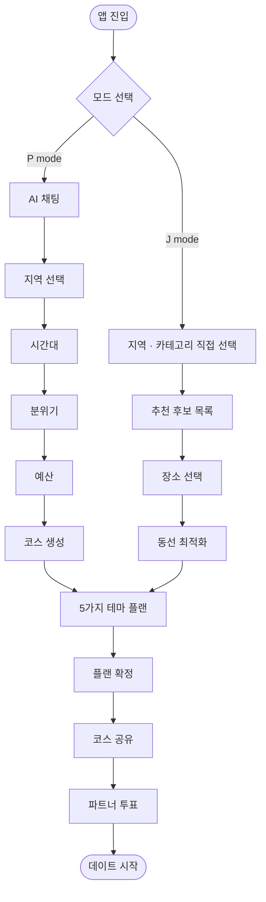
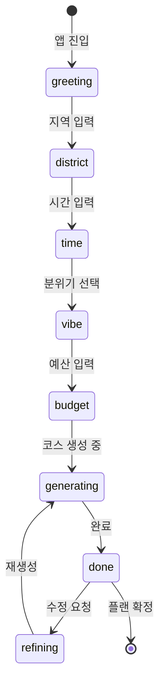
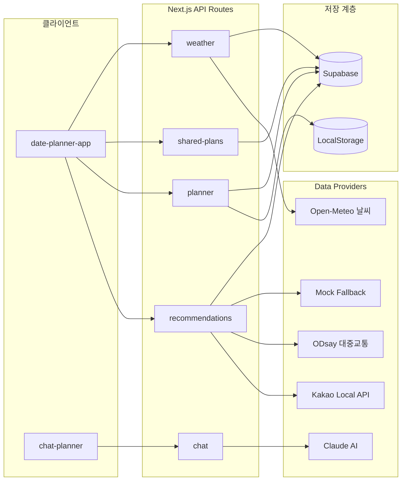
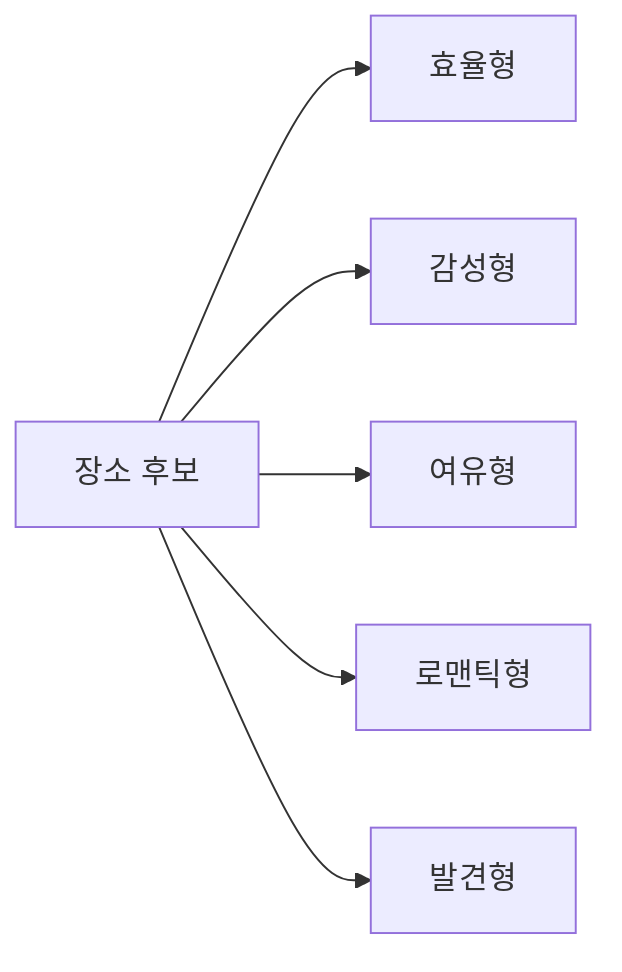

# Couple — 서울 데이트 플래너

> AI와 함께 설계하는 서울 맞춤 데이트 코스

**P mode** — AI 채팅으로 취향을 물어보고 코스를 자동 설계
**J mode** — 직접 지역·카테고리를 골라 동선을 최적화

5가지 테마 플랜 · 날씨 감지 · 코스 공유 · 파트너 투표 · 카카오 로그인

---

## 앱 흐름



---

## P mode — AI 채팅 상태 흐름



---

## 아키텍처



---

## 5가지 테마 플랜



---

## 시작하기

```bash
npm install
npm run dev        # http://localhost:3000
npm run build      # 프로덕션 빌드 검증
```

---

## 환경 변수

`.env.local`을 생성하고 아래를 채웁니다.
**비워두면 앱은 mock provider와 로컬 저장으로 자동 동작합니다.**

```bash
# ── 장소 검색 ──────────────────────────────
KAKAO_REST_API_KEY=          # 없으면 mock 장소 데이터

# ── 대중교통 ───────────────────────────────
ODSAY_API_KEY=               # 없으면 mock 이동 시간

# ── AI 채팅 (P mode) ───────────────────────
ANTHROPIC_API_KEY=           # 없으면 rule-based 응답

# ── 저장 / 공유 / 캐시 ─────────────────────
NEXT_PUBLIC_SUPABASE_URL=
NEXT_PUBLIC_SUPABASE_ANON_KEY=
SUPABASE_SERVICE_ROLE_KEY=   # 없으면 로컬 저장 전용

# ── 인증 (필수) ────────────────────────────
NEXTAUTH_SECRET=             # 아래 명령으로 생성
NEXTAUTH_URL=https://your-domain.com

# ── 카카오 로그인 (선택) ───────────────────
KAKAO_CLIENT_ID=
KAKAO_CLIENT_SECRET=
NEXT_PUBLIC_KAKAO_AUTH_ENABLED=false
NEXT_PUBLIC_KAKAO_JS_KEY=
```

> `NEXTAUTH_SECRET` 생성:
> ```bash
> node -e "console.log(require('crypto').randomBytes(32).toString('base64'))"
> ```

---

## 기능 상태

| 기능 | 활성 조건 | 미설정 시 |
|------|-----------|-----------|
| 장소 검색 | `KAKAO_REST_API_KEY` | mock 데이터 |
| 대중교통 | `ODSAY_API_KEY` | mock 이동 시간 |
| AI 채팅 | `ANTHROPIC_API_KEY` | rule-based 응답 |
| 날씨 감지 | — (Open-Meteo, 무료) | 항상 동작 |
| 코스 저장·공유 | Supabase 3개 변수 | 로컬 저장 |
| 카카오 로그인 | `KAKAO_*` + `ENABLED=true` | 로그인 비활성 |

---

## Supabase

[`supabase/schema.sql`](supabase/schema.sql)을 Supabase SQL 에디터에서 실행합니다.

| 테이블 | 용도 |
|--------|------|
| `saved_plans` | 코스 저장 |
| `api_cache` | 추천·날씨 캐시 (30분) |
| `place_review_summaries` | 장소 리뷰 요약 |
| `shared_plans` | 코스 공유 및 파트너 투표 |

---

## API

| 엔드포인트 | 메서드 | 설명 |
|-----------|--------|------|
| `/api/health` | GET | 환경 구성 상태 |
| `/api/diagnostics` | GET | provider 상태 상세 |
| `/api/chat` | POST | AI 채팅 (P mode) |
| `/api/recommendations` | POST | 장소 추천 후보 |
| `/api/custom-plan` | POST | 커스텀 추천 → 플래너 변환 |
| `/api/planner` | POST | 시나리오 기반 플래너 |
| `/api/saved-plans` | GET / POST | 코스 저장·조회 |
| `/api/shared-plans` | GET / POST / PATCH | 코스 공유·파트너 투표 |
| `/api/weather` | GET | 서울 현재 날씨 |

---

## Live 전환 체크리스트

1. 환경 변수 설정 → `npm run build`
2. `GET /api/health` — `readyForLive: true` 확인
3. `GET /api/diagnostics` — provider 상태 확인
4. `POST /api/recommendations` — `candidates[].source: "kakao"` 확인
